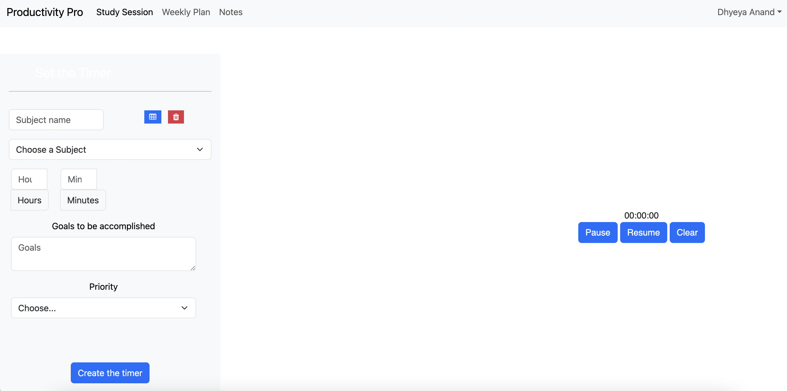

# Productivity Pro

This is an application built to help with your studying needs.

The app allows you
- to set timers.
- track your studying time.
- Create a study schedule for you based on your needs.
- take miniature notes.

## Where it's hosted
----

It is hosted on github
https://github.com/arte5craft/IAComputerScience




## Getting Started
----

- Clone the repo:  `git clone https://github.com/arte5craft/IAComputerScience`

- Install and run with [npm](https://www.npmjs.com/):
```
npm install
npm start
```
